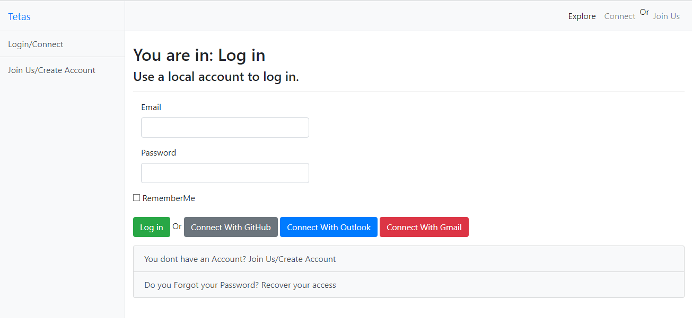
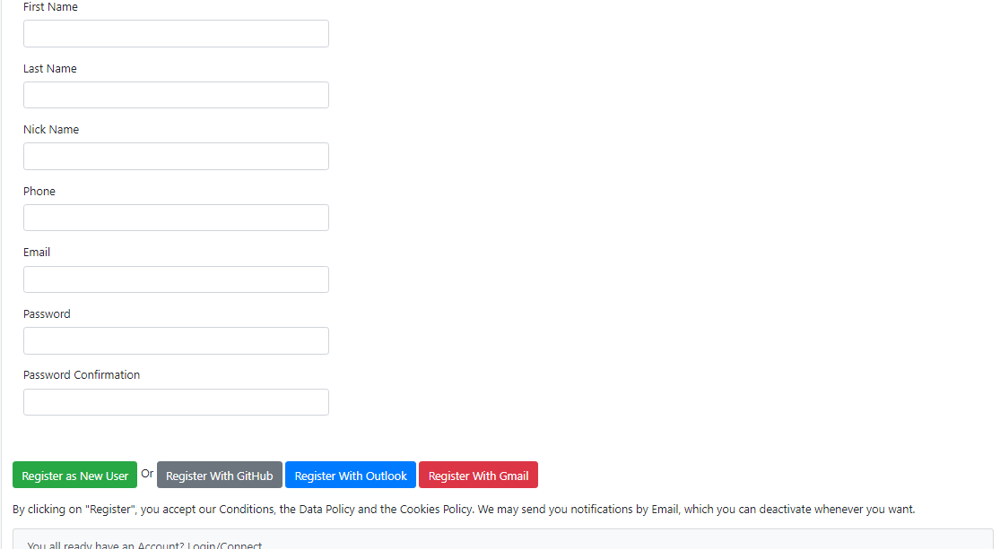
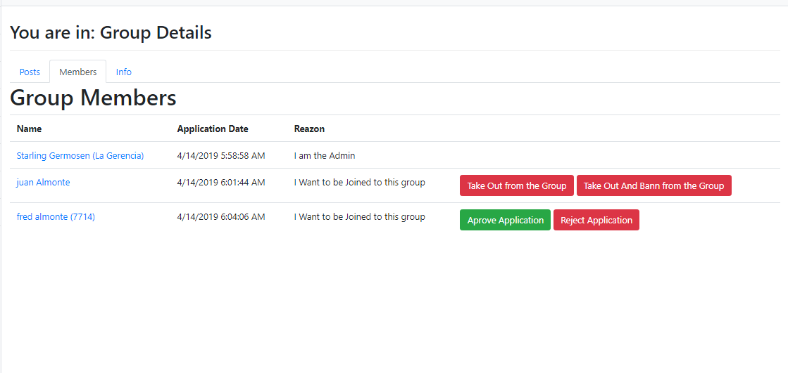
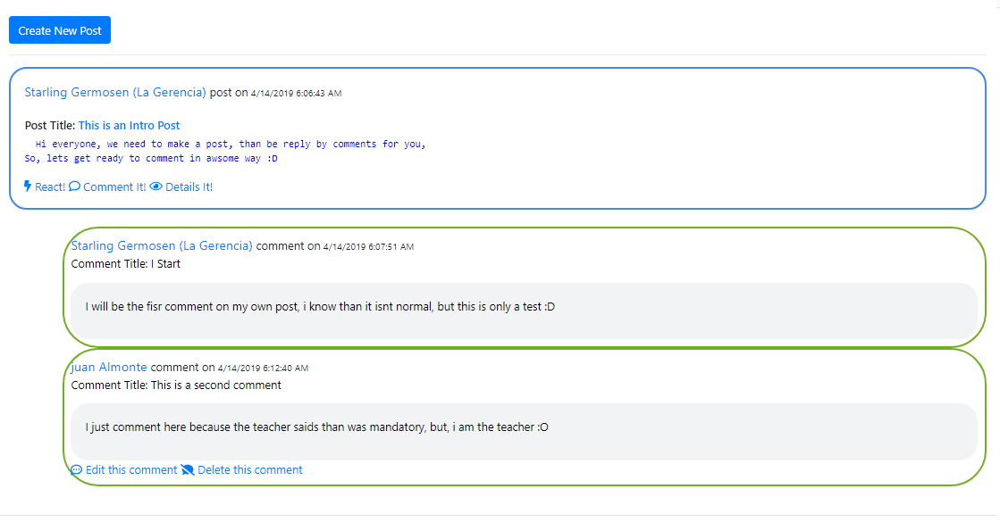

# TETAS (Tracking Education For Teachers and Students)

Is an open source social networking web application that provides a robust app on which to build all kinds of social environments, from a campus wide social network for your university, school or college or an internal collaborative platform for your organization through to a brand-building communications tool for your company and its clients. But the main goal is communicate teachers and student than need to be connected but don’t want to mix personal and professional environments.

If you want to see the introduction of a mini-course that I prepared, check this video: https://www.youtube.com/watch?v=-E-rAqeGKp4&t=69s&list=PLE4SNWIDX7wtQd3fA5Aa6cJExKaruJ19C&index=2

# Things than are ready done

*User can register on the app with a valid email. 		 
*User can edit their own personal info.				 
*User can create posts.
*User can edit their own posts.
*User can create comments on posts.
*User can edit their own comments on posts.
*User can create groups.
*User can edit their own groups.		
*User can ask for join to a groups.	
*User can Accept the asking to join on groups where he is owner or moderator
*User can reject the asking to join on groups where he is owner or moderator
*User can fire members on groups where he is owner or moderator
*User can ban members on groups where he is owner or moderator
*User can disban members on groups where he is owner or moderator
*User can see members on groups where he is member or owner.
*User can see posts on groups where he is member or owner.
*User can create posts on groups where he is member or owner.
*User can edit their own posts on groups where he is member or owner.
*User can create comments on groups where he is member or owner.
*User can edit their own comments on groups where he is member or owner.
 
 
 See the WhatNeedToBeDone.txt if you want to colaborate with something and fell confortable to open an issue if you need it.
 
 Please, feel free to pull a Request, and colaborate with it, I promese check all the request, test it, and add it.
 
 
 # Captures
 
  # Login
 
 
  # Registration
  
  
  # Group List (Only public or my groups)
  
   
  # Group Members (Only see for who is member, and if is admin or moderator can fire or ban a user)
  
    
  # Profile (Only can be edited by the owner, but consultant by everyone)
  
     
  # Group Posts and Comments (Only members can see it, and only owner can edit it)
  

# Getting Started
TODO: Guide users through getting your code up and running on their own system. In this section you can talk about:
1.	Installation process
2.	Software dependencies
3.	Latest releases
4.	API references

 
