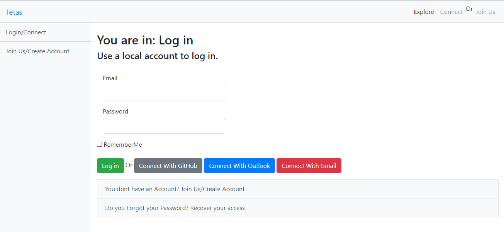
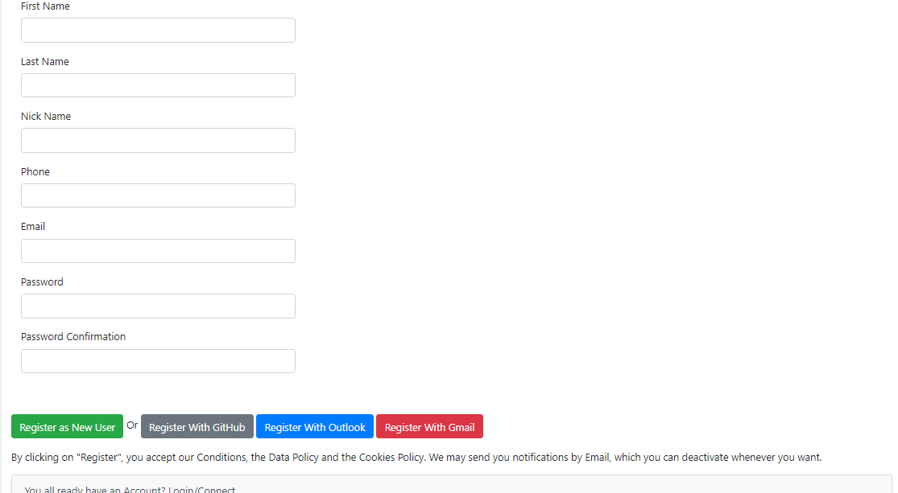
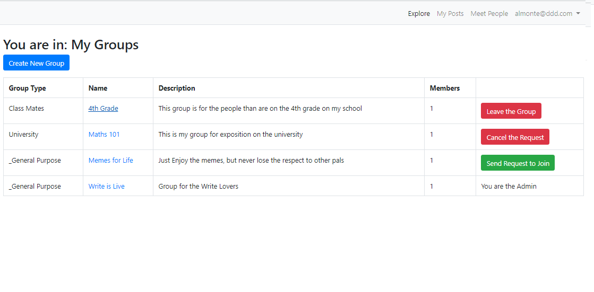
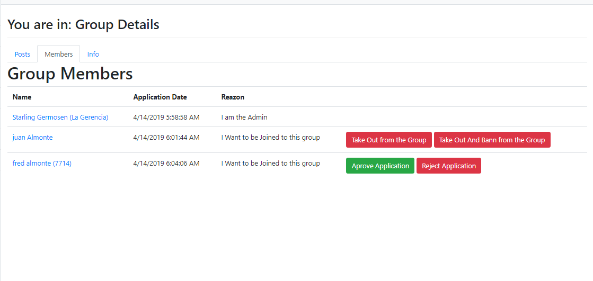
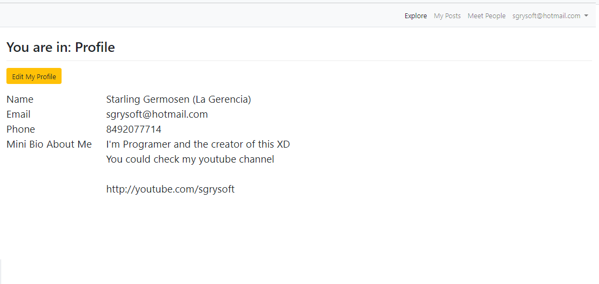
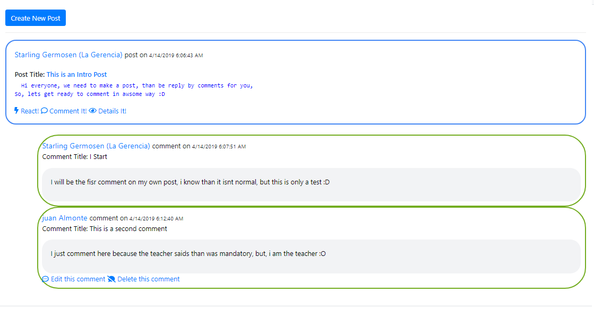

# TETAS (Tracking Education For Teachers and Students)

Is an open source social networking web application that provides a robust app on which to build all kinds of social environments, from a campus wide social network for your university, school or college or an internal collaborative platform for your organization through to a brand-building communications tool for your company and its clients. But the main goal is communicate teachers and student than need to be connected but don’t want to mix personal and professional environments.

If you want to see the introduction of a mini-course that I prepared, check this video: https://www.youtube.com/watch?v=-E-rAqeGKp4&t=69s&list=PLE4SNWIDX7wtQd3fA5Aa6cJExKaruJ19C&index=2

# Things than are ready done

* User can register on the app with a valid email.  
* User can edit their own personal info.				
* User can create posts.
* User can edit their own posts.
* User can create comments on posts.
* User can edit their own comments on posts.
* User can create groups.
* User can edit their own groups.		
* User can ask for join to a groups.	
* User can Accept the asking to join on groups where he is owner or moderator.
* User can reject the asking to join on groups where he is owner or moderator.
* User can fire members on groups where he is owner or moderator.
* User can ban members on groups where he is owner or moderator.
* User can disban members on groups where he is owner or moderator.
* User can see members on groups where he is member or owner.
* User can see posts on groups where he is member or owner.
* User can create posts on groups where he is member or owner.
* User can edit their own posts on groups where he is member or owner.
* User can create comments on groups where he is member or owner.
* User can edit their own comments on groups where he is member or owner.
 
 
 See the WhatNeedToBeDone.txt if you want to colaborate with something and fell confortable to open an issue if you need it.
 
 Please, feel free to pull a Request, and colaborate with it, I promese check all the request, test it, and add it.
 
 
 # Captures
 
  ## Login
 
 
  ## Registration
  
  
  ## Group List (Only public or my groups)
  
   
  ## Group Members (Only see for who is member, and if is admin or moderator can fire or ban a user)
  
    
  ## Profile (Only can be edited by the owner, but consultant by everyone)
  
     
  ## Group Posts and Comments (Only members can see it, and only owner can edit it)
  


# Tech stack

The application was modernized from ASP.NET Core 2.2 to **.NET 10**.

* **Web:** ASP.NET Core 10 MVC (`Tetas.Web`)
* **Data:** Entity Framework Core 10 with ASP.NET Core Identity
* **Database:** SQLite by default (zero setup), SQL Server optional
* **API:** JWT-secured REST endpoints under `/api` for mobile/SPA clients
* **Mobile:** a Flutter client in `mobile/` that consumes the REST API

The solution keeps a layered structure: `Tetas.Domain` (entities),
`Tetas.Infraestructure` (DbContext, configurations, migrations, seeding),
`Tetas.Repositories` (data access), `Tetas.Common` (view models),
`Tetas.Web` (MVC + API + SignalR) and `Tetas.Tests` (xUnit tests).

Highlights of the 2026 modernization: post reactions, realtime notifications
over SignalR, HTML sanitization against stored XSS, JWT-secured REST API,
EF Core migrations, a themeable redesigned UI, a Flutter client, a test
suite, CI and Docker support.

# Getting Started

## Requirements

* [.NET SDK 10](https://dotnet.microsoft.com/download)

## Run the web app

```bash
dotnet run --project Tetas.Web
```

The app uses SQLite out of the box and creates a local `tetas.db` on first
run, so no database server is required. Browse to the URL printed in the
console (for example `http://localhost:5000`).

To use SQL Server instead, set `DatabaseProvider` to `SqlServer` and provide
the `sGDatabaseCnn` connection string in configuration.

## Run with Docker

```bash
docker compose up --build
```

The app is served on `http://localhost:8080` and the SQLite database is kept
in a named volume.

## Tests

```bash
dotnet test          # backend unit and integration tests
cd mobile && flutter test   # mobile widget tests
```

A GitHub Actions workflow (`.github/workflows/ci.yml`) builds and tests both
the backend and the Flutter app on every push.

## Configuration and secrets

No secrets are committed to this repository. For production set the JWT
signing key and mail credentials through user secrets or environment
variables, for example:

```bash
dotnet user-secrets set "Tokens:Key" "<a-long-random-secret>" --project Tetas.Web
```

In development a random signing key is generated at startup if none is
configured.

## REST API

The main endpoints are:

| Method | Route                         | Description                     |
| ------ | ----------------------------- | ------------------------------- |
| POST   | `/api/auth/register`          | Register and receive a JWT      |
| POST   | `/api/auth/login`             | Log in and receive a JWT        |
| GET    | `/api/auth/me`                | Current user (bearer required)  |
| GET    | `/api/posts`                  | Latest posts feed               |
| GET    | `/api/posts/{id}`             | A single post with comments     |
| POST   | `/api/posts`                  | Create a post                   |
| POST   | `/api/posts/{id}/comments`    | Comment on a post               |
| POST   | `/api/posts/{id}/reactions`   | React to a post (toggle)        |
| DELETE | `/api/posts/{id}`             | Delete your post                |
| GET    | `/api/groups`                 | Public and joined groups        |
| GET    | `/api/notifications`          | Your notifications              |
| POST   | `/api/notifications/read-all` | Mark all notifications read     |

All routes except register and login require an `Authorization: Bearer <token>`
header.

## Mobile app

A Flutter client lives in [`mobile/`](mobile/README.md). It authenticates
against the REST API and provides the feed, post details, commenting, post
creation, groups and profile. See its README to run it and point it at your
API instance.

